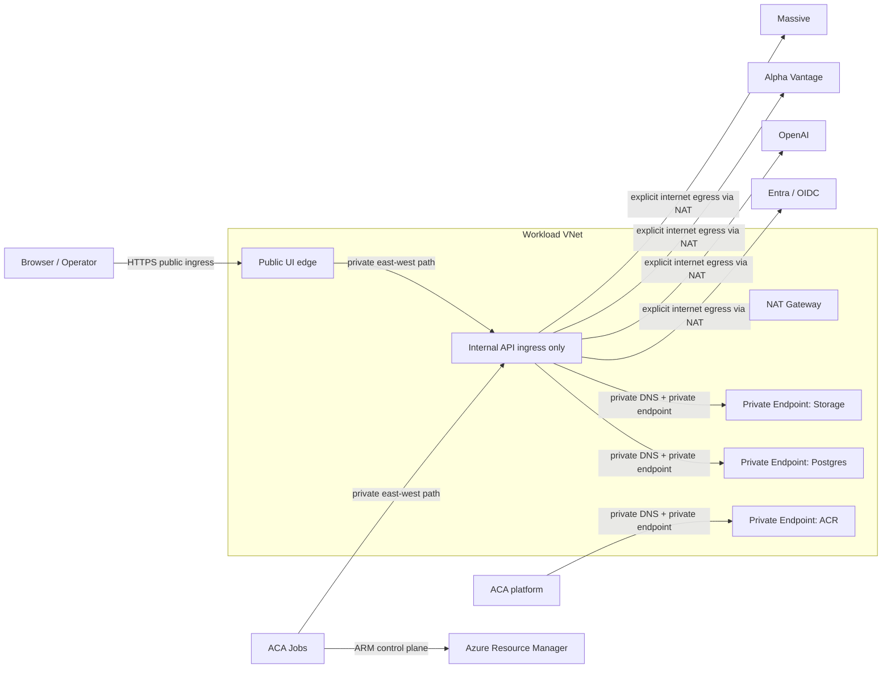

# Networking Audit for Control Plane and Shared Azure Runtime

Recommendation: treat the current network posture as transitional, not as the target production design. Keep only the true public edge public, move the data plane to private connectivity, make ingress policy explicit in deploy-time configuration, and add deterministic egress ownership before adding heavier network abstractions.

This is local-only and does not require contracts repo routing.

Audit date: April 18, 2026  
Runtime scope: live Azure resources in `AssetAllocationRG` plus repo sources of truth in this repository

## Objective

Audit the networking posture of the control-plane repository and the live shared Azure runtime together. The goal is to distinguish what is explicitly designed in code and IaC from what is currently implied by the deployed Azure substrate, then recommend the smallest credible target topology that meets a production benchmark of:

- public edge only where required
- private data plane by default
- explicit ingress policy
- explicit egress ownership

## Assumptions

- Scope includes the live shared runtime in `AssetAllocationRG` as observed on April 18, 2026.
- The audit is read-only. No repo-tracked runtime behavior was changed and no Azure resources were mutated.
- Cross-repo consumers such as the UI and jobs repos are included only where they materially affect traffic into or out of this control-plane environment.
- Facts are based on repo files and live Azure CLI inspection. Where a transport path is not explicitly defined in this repo, it is marked as an inference.

## Current Topology

### Observed live state

| Resource | Facts | Evidence |
| --- | --- | --- |
| Container Apps environment | `asset-allocation-env` in East US, `publicNetworkAccess=Enabled`, `vnetConfiguration=null`, `zoneRedundant=false`, peer mTLS disabled, peer traffic encryption disabled | Live `az containerapp env show` on April 18, 2026 |
| API app | `asset-allocation-api` has `external=true`, no `ipSecurityRestrictions`, no custom domains, 321 outbound IPs, `minReplicas=1`, `maxReplicas=1` | Live `az containerapp show` on April 18, 2026 |
| UI app | `asset-allocation-ui` has `external=true` and uses `API_UPSTREAM=asset-allocation-api.bluesea-887e7a19.eastus.azurecontainerapps.io` over `https` | Live `az containerapp show` on April 18, 2026 |
| Jobs | 18 Container App Jobs share the same ACA environment; trigger types are `Manual` and `Schedule` | Live `az containerapp job list` on April 18, 2026 |
| Postgres | `pg-asset-allocation` runs in East US 2 with `publicNetworkAccess=Enabled`, no delegated subnet, no private DNS zone, `highAvailability.mode=Disabled` | Live `az postgres flexible-server show` on April 18, 2026 |
| Postgres firewall | Rules include `allow-azure-services` plus manual/stale rules such as `allow-current-client-ip`, `public-dip`, `codex-temp-schema-drop`, and `office-laptop` using RFC1918 `172.19.224.1` | Live `az postgres flexible-server firewall-rule list` on April 18, 2026 |
| Storage account | `assetallocstorage001` has `defaultAction=Allow`, zero VNet rules, zero IP rules, zero private endpoints, TLS 1.2 enforced | Live `az storage account show` on April 18, 2026 |
| ACR | `assetallocationacr` has `publicNetworkAccess=Enabled`, no network rule set, zero private endpoints, anonymous pull disabled | Live `az acr show` on April 18, 2026 |
| Network substrate | `AssetAllocationRG` currently contains zero `Microsoft.Network/*` resources | Live `az resource list` on April 18, 2026 |

### Repo-defined posture

| Topic | Facts | Evidence |
| --- | --- | --- |
| Private API manifest exists | `deploy/app_api.yaml` sets `ingress.external: false` | `deploy/app_api.yaml:12` |
| Public API manifest exists | `deploy/app_api_public.yaml` sets `ingress.external: true` | `deploy/app_api_public.yaml:12` |
| Active deploy path uses public manifest | `deploy-prod.yml` renders and applies `deploy/app_api_public.yaml` unconditionally | `.github/workflows/deploy-prod.yml:195` |
| Runbook presents public and private ingress as options | `DEPLOYMENT_SETUP.md` says to use `deploy/app_api_public.yaml` for public ingress or `deploy/app_api.yaml` for private ingress | `DEPLOYMENT_SETUP.md:137` |
| Public surfaces are explicitly routed | `/docs`, `/openapi.json`, `/healthz`, `/readyz`, and `/config.js` are routed at app root without auth middleware in the app composition root | `api/service/app.py:430` |
| Deployed runtime requires OIDC | if the runtime is not local and OIDC is not configured, settings resolution raises instead of falling back to anonymous access | `api/service/settings.py:238` |
| Browser/API auth is bearer-token based | missing bearer tokens produce `401`; role checks produce `403` | `api/service/auth.py:181` |
| CORS is app-layer, not network-layer | default allowed origins are localhost-focused unless `API_CORS_ALLOW_ORIGINS` is set | `api/service/app.py:140` |
| Jobs are documented consumers of internal endpoints | `/api/internal/backtests/ready` and `/api/internal/backtests/runs/reconcile` are documented for trusted jobs consumers | `README.md:72` |
| Jobs may use ARM to wake apps and start jobs | provisioning script grants RG Contributor because jobs may trigger downstream jobs and wake API container apps via ARM | `scripts/ops/provision/provision_azure.ps1:1316` |

### Current-state diagram

```mermaid
flowchart LR
    Browser["Browser / Operator"] -->|HTTPS public ingress| API["asset-allocation-api\nACA external ingress"]
    Browser -->|HTTPS public ingress| UI["asset-allocation-ui\nACA external ingress"]
    UI -->|HTTPS to public ACA FQDN| API

    Jobs["18 ACA Jobs\nsame environment"] -->|authenticated internal endpoints\n(fact: endpoints exist, path transport inferred)| API
    Jobs -->|ARM control plane\njob start / app wake| ARM["Azure Resource Manager"]

    API -->|public FQDN + firewall| PG["Postgres Flexible Server\nEast US 2\npublic access"]
    API -->|public storage endpoints\nconnection string| Storage["Storage Account\npublic network allowed"]
    ACA["ACA platform / revision startup"] -->|managed identity pull| ACR["ACR\npublic network enabled"]
    API -->|public HTTPS| Entra["Entra / OIDC metadata and JWKS"]
    API -->|public HTTPS| OpenAI["OpenAI Responses API"]
    API -->|public HTTPS| Alpha["Alpha Vantage"]
    API -->|public HTTPS| Massive["Massive"]
```

## Traffic Flow

### Browser or operator to API public ingress

Facts:

- The API app is externally reachable at `asset-allocation-api.bluesea-887e7a19.eastus.azurecontainerapps.io`.
- `/healthz` and `/readyz` return `200`.
- `/openapi.json` redirects to `/asset-allocation/api/openapi.json`, which returns the OpenAPI payload without authentication.
- `/asset-allocation/api/docs` returns Swagger UI without authentication.
- `/config.js` returns `200` and exposes browser auth configuration without authentication.
- `/api/auth/session` returns `401` without a bearer token.

Inference:

- The public edge is broad enough for unauthenticated discovery and diagnostics, even though business routes are protected by OIDC and role checks.

### UI to API

Facts:

- The live UI app is also externally exposed.
- The live UI container config points to the API using the API public ACA FQDN over HTTPS.

Inference:

- UI to API service-to-service traffic is currently pinned to the public API endpoint rather than an internal or private path.
- Even when the user browser is the ultimate client, the current shared runtime does not define a private east-west service boundary between UI and API.

### Jobs to API and Azure ARM

Facts:

- 18 Container App Jobs run in the same ACA environment as the API and UI.
- The repo documents authenticated internal API endpoints for trusted backtest consumers and reconcile tasks.
- The provisioning script explicitly grants RG-scope Contributor because jobs may trigger downstream jobs and wake API container apps via ARM.

Inference:

- The jobs-to-ARM control-plane path is explicit.
- The exact jobs-to-API URL is not defined in this repo, but because there is no private ingress, VNet, or private DNS strategy in the shared runtime, the platform currently offers only public-service connectivity unless a consumer-specific workaround exists outside this repo.

### API to Postgres

Facts:

- The API manifest and live app both inject `POSTGRES_DSN`.
- Postgres uses a public FQDN and public firewall rules.
- There is no delegated subnet or private DNS zone.

Inference:

- Database traffic currently relies on public-service routing plus firewall and credential controls, not on private connectivity.

### API to Storage

Facts:

- The API manifest injects `AZURE_STORAGE_CONNECTION_STRING`.
- The storage account has `defaultAction=Allow`, no VNet rules, and no private endpoints.

Inference:

- Storage access is currently public-endpoint based and shared-key oriented from a network perspective.

### API or platform to ACR

Facts:

- The app manifests configure ACA registry access to `assetallocationacr.azurecr.io` using a user-assigned identity.
- ACR public network access is enabled and private endpoints are absent.
- The provisioning script configures apps and jobs to pull from ACR via managed identity.

Inference:

- Image pull traffic depends on public ACR reachability even though auth is identity-based.

### API to Entra, OpenAI, Alpha Vantage, and Massive

Facts:

- OIDC discovery and JWKS fetches are done over HTTPS.
- The AI relay, Alpha Vantage, and Massive integrations are all external HTTPS dependencies.
- There is no VNet, NAT Gateway, Azure Firewall, or other explicit egress control plane.

Inference:

- All outbound dependency traffic currently exits through ACA-managed public egress with no deterministic source-IP ownership.

## Routing and DNS

Facts:

- The shared runtime currently has no VNet, subnet, route table, NSG, Azure Firewall, NAT Gateway, private endpoint, or private DNS resources.
- ACA uses the default public suffix `bluesea-887e7a19.eastus.azurecontainerapps.io`.
- Postgres resolves via the public `postgres.database.azure.com` namespace.
- Storage and ACR also rely on public Azure service DNS.

Inference:

- There is no private routing domain in the current design.
- DNS is entirely public-service driven. Split-horizon design, conditional forwarding, and private-name ownership have not been defined.
- Because the ACA environment advertises 321 outbound IPs, upstream allowlisting based on current public egress is operationally weak.

## Security Controls

Network-level controls in place:

- TLS-only ingress for ACA apps.
- No anonymous pull on ACR.
- Storage blocks anonymous blob access.
- Postgres still requires valid credentials in addition to firewall access.

App-layer compensating controls in place:

- Deployed runtimes require OIDC configuration and do not silently degrade to anonymous mode.
- Missing bearer tokens return `401`.
- Missing required roles return `403`.
- AI relay requires the route-specific role `AssetAllocation.AiRelay.Use`.
- CORS is explicitly configured and defaults to localhost origins unless set otherwise.

Network-level controls missing:

- No IP allowlists or `ipSecurityRestrictions` on the live public API.
- No WAF, Front Door, Application Gateway, or custom domain edge policy.
- No private connectivity for Postgres, Storage, or ACR.
- No internal-only east-west path between UI and API.
- No intra-environment mTLS or peer traffic encryption in ACA.
- No explicit egress policy or deterministic SNAT ownership.

Judgment:

- The current posture leans heavily on authentication and TLS. That is acceptable for a low-scale operator tool only if the public exposure is intentional and the blast radius is accepted. It is not a strong network posture for a production control plane handling stateful data services.

## High Availability and Failure Domains

Facts:

- ACA environment is East US and not zone redundant.
- API and UI each run with `minReplicas=1` and `maxReplicas=1`.
- Postgres runs in East US 2 with HA disabled.
- Jobs share the same non-zonal ACA environment.
- There is no edge failover layer such as Front Door, Traffic Manager, or multi-region routing.

Inference:

- The design has a region split between application compute and database.
- The current steady state is cost-minimized, but failover behavior is mostly "single instance remains healthy" rather than designed high availability.
- The cross-region ACA-to-Postgres dependency is a latent failure-domain mismatch even if latency is currently acceptable.

## Cost and Operational Tradeoffs

Current design advantages:

- Lowest-cost shared Azure footprint.
- Very little network infrastructure to operate.
- Fast to provision and easy to understand at a superficial level.

Current design costs and risks:

- Public-service exposure substitutes for private connectivity.
- Public egress is large and non-deterministic.
- Data-plane hardening is blocked by lack of a private routing substrate.
- Incident response depends on credentials and logs more than on boundary controls.
- The gap between documented private-ingress capability and actual public deploy behavior increases configuration drift risk.

Recommended tradeoff:

- Keep the estate simple. Do not introduce Virtual WAN, transit hubs, or Azure Firewall unless there is a real multi-network requirement.
- Spend the next tranche of complexity budget on private endpoints, private DNS, an explicit ingress switch, and deterministic egress. Those changes buy materially more risk reduction than introducing heavy network abstractions.

## Ranked Findings with Evidence

### P1 - Private data plane is absent for Postgres, Storage, and ACR

Facts:

- Postgres public access is enabled with no delegated subnet and no private DNS zone.
- Storage allows public network access with zero VNet or IP rules and zero private endpoints.
- ACR public network access is enabled with zero private endpoints.

Inference:

- The runtime depends on public-service connectivity for all major data-plane services.
- `allow-azure-services` on Postgres means any Azure-originating client with credentials can attempt connection, which is materially broader than a workload-scoped private design.

Recommendation:

- Move Postgres, Storage, and ACR to private connectivity first. This is the highest-value network change in the estate.

Evidence:

- Live Azure inspection on April 18, 2026 for ACA env, Postgres, Storage, and ACR

### P1 - The active deployment path hard-codes public API ingress

Facts:

- A private-ingress manifest exists.
- The deploy workflow always renders and applies the public-ingress manifest.
- The live API app is externally exposed with no IP restrictions and no custom domain edge controls.

Inference:

- Public ingress is not just an option. It is the enforced deployment default today.
- The runbook presents ingress as a choice, but the workflow does not expose that choice.

Recommendation:

- Add an explicit ingress mode selector to deployment inputs and stop hard-coding the public manifest.

Evidence:

- `deploy/app_api.yaml:12`
- `deploy/app_api_public.yaml:12`
- `.github/workflows/deploy-prod.yml:195`
- `DEPLOYMENT_SETUP.md:137`

### P2 - Public surfaces are broader than the authenticated control plane alone

Facts:

- `/healthz`, `/readyz`, `/docs`, `/openapi.json`, and `/config.js` are reachable without authentication when ingress is public.
- `/api/auth/session` returns `401` without a bearer token.
- Deployed runtimes require OIDC; business routes are not anonymously accessible by default.

Inference:

- Authentication protects most operational surfaces, but public discovery and runtime metadata exposure remain intentionally open at the edge.

Recommendation:

- Decide whether public docs and runtime config are intentional in production. If not, gate them behind auth or disable them on public deployments.

Evidence:

- Live HTTP reachability checks on April 18, 2026
- `api/service/app.py:430`
- `api/service/settings.py:238`
- `api/service/auth.py:181`

### P2 - UI to API traffic uses the public API endpoint instead of a private east-west path

Facts:

- The live UI container points to the API public FQDN over HTTPS.
- Both UI and API are externally exposed in the same ACA environment.

Inference:

- The runtime treats the API as a public service even for in-estate UI traffic.
- This is a design smell unless browser-direct API access is a deliberate requirement that outweighs a cleaner internal boundary.

Recommendation:

- Prefer one public edge. Keep the UI public if needed, and move the API to internal ingress with UI proxying or a single explicit edge service.

Evidence:

- Live `az containerapp show` for `asset-allocation-ui` and `asset-allocation-api` on April 18, 2026

### P2 - Egress ownership is undefined and operationally weak

Facts:

- The ACA environment is not VNet-integrated.
- The API currently advertises 321 outbound IPs.
- There is no NAT Gateway, Azure Firewall, or route-control layer.

Inference:

- Upstream allowlisting and egress attribution are poor.
- The current design works until an upstream dependency needs deterministic source IPs or stricter policy enforcement.

Recommendation:

- When the workload VNet is introduced, attach NAT Gateway and make egress ownership explicit. Do not solve this with a larger public IP spreadsheet.

Evidence:

- Live `az containerapp env show` and `az containerapp show` on April 18, 2026

### P2 - Resilience is cost-optimized but not network-robust

Facts:

- ACA environment is East US and not zone redundant.
- Postgres runs in East US 2 with HA disabled.
- API and UI are single-replica steady-state workloads.
- No edge failover layer is present.

Inference:

- The design prioritizes low cost and simplicity over regional or zonal resilience.
- The East US to East US 2 split is not a credible long-term steady-state failure-domain design.

Recommendation:

- During the next substrate refresh, co-locate ACA and Postgres in one region and decide explicitly whether HA and zone redundancy are required by RTO and RPO, rather than inheriting the current split by accident.

Evidence:

- Live Azure inspection on April 18, 2026

### P3 - Firewall hygiene and network configuration drift are already visible

Facts:

- Postgres firewall rules include `allow-azure-services`, `allow-current-client-ip`, and stale/manual rules.
- One firewall rule uses RFC1918 `172.19.224.1`, which is not a meaningful public source for a public Azure database endpoint.
- `docs/ops/env-contract.csv` covers auth, CSP, CORS, and core Azure resource names, but does not expose ingress mode selection, IP allowlists, VNet inputs, private endpoint inputs, or private DNS inputs.

Inference:

- The current design invites manual network exceptions because there is no first-class deploy contract for network posture.

Recommendation:

- Clean up the existing Postgres rules and make ingress or private-connectivity posture part of the deploy contract instead of relying on ad hoc Azure changes.

Evidence:

- Live `az postgres flexible-server firewall-rule list` on April 18, 2026
- `docs/ops/env-contract.csv:1`

## Recommended Target Topology

Preferred target:

- Keep the estate simple and single-environment. Do not add Virtual WAN, hub-spoke transit, or Azure Firewall by default.
- Keep one true public HTTP edge.
- If browser access remains required, keep `asset-allocation-ui` public.
- Move `asset-allocation-api` to internal ingress only.
- Introduce one workload VNet for the shared runtime.
- Add private endpoints plus private DNS zones for:
  - Postgres Flexible Server
  - Storage account data endpoints actually used by the platform
  - ACR
- Make outbound internet egress explicit with NAT Gateway once the workload VNet exists.
- Preserve OIDC, route-level auth, and CORS as app-layer controls on top of the network changes.
- Align ACA and Postgres to the same region during the next shared-runtime refresh instead of keeping the East US and East US 2 split as steady state.

Target-state diagram:



## Phased Remediation Plan

### Phase 0 - Make the current public posture explicit

- Add deployment input for ingress mode instead of hard-coding `deploy/app_api_public.yaml`.
- Add deployment input for API IP allowlists or ACA `ipSecurityRestrictions` when public ingress is chosen.
- Decide whether `/docs`, `/openapi.json`, and `/config.js` should stay publicly reachable in production.
- Remove stale Postgres firewall rules and name an owner for ongoing rule hygiene.
- Inventory all consumers that currently depend on the public API FQDN.

Rollback point:

- No network cutover yet. Changes are deploy-contract and policy changes only.

### Phase 1 - Build the private data-plane substrate

- Create a workload VNet and the required private DNS zones.
- Introduce private endpoints for Postgres, Storage, and ACR.
- Update the shared runtime substrate so ACA workloads can resolve and reach those private endpoints.
- Replace public Postgres access and remove `allow-azure-services` after application reachability is proven.
- Restrict Storage and ACR public access after ACA and deployment pull paths are validated privately.

Rollback point:

- Keep public endpoints enabled until private-path validation succeeds for each dependency.

### Phase 2 - Collapse to one public edge

- Move the API to internal ingress only.
- Keep the UI public only if browser access remains required.
- Proxy `/api` through the UI or a single explicit edge service instead of having the UI target the API public FQDN.
- Validate that jobs and operator flows no longer require public API reachability.

Rollback point:

- Keep the public API manifest available until the internal API path is validated end to end.

### Phase 3 - Fix resilience and steady-state ownership

- Co-locate ACA and Postgres in one region during the next substrate refresh.
- Decide explicitly whether Postgres HA and zonal resilience are required by business objectives.
- Add egress monitoring and ownership around the NAT path.
- Document DNS ownership, rollback steps, and expected source IP behavior.

Rollback point:

- Use staged cutover by dependency and region rather than a single all-at-once move.

## Validation Checklist

- Confirm whether the target deployment uses public or private API ingress before rollout.
- Verify API public surfaces intentionally left open still match policy.
- Verify `/api/auth/session` still requires bearer auth on public deployments.
- Verify UI to API traffic uses the intended internal or public path after each cutover.
- Verify private DNS resolution from ACA workloads for Postgres, Storage, and ACR.
- Verify Postgres connectivity after removing `allow-azure-services`.
- Verify ACR image pulls continue to work after private endpoint and DNS cutover.
- Verify storage reads and writes continue to work after private endpoint cutover.
- Verify outbound dependencies still work after NAT-based egress is introduced.
- Verify no consumer still depends on the old public API FQDN before disabling it.
- Verify region, failover, and restart behavior match documented expectations after topology changes.

## Watch-outs

- ACA networking changes can force substrate-level replacement or coordinated cutover. Do not assume this will be a zero-impact in-place edit.
- Private endpoint projects fail most often on DNS, not on the endpoint object itself. Treat private DNS as part of the same change.
- `allow-azure-services` can hide unexpected clients. Inventory consumers before removing it.
- Storage connection-string usage is convenient but weakens least-privilege and network-restriction options. Plan to reduce dependence on shared-key patterns where supported.
- ACR private access requires both registry reachability and correct name resolution for the platform pull path.
- Do not carry the East US and East US 2 split forward by default. Either make the split an explicit decision or remove it.

## Evidence Used

Repo evidence:

- `README.md:55`
- `DEPLOYMENT_SETUP.md:122`
- `.github/workflows/deploy-prod.yml:195`
- `deploy/app_api.yaml:12`
- `deploy/app_api_public.yaml:12`
- `api/service/app.py:321`
- `api/service/settings.py:199`
- `api/service/auth.py:181`
- `api/API_ENDPOINTS.md:1`
- `scripts/ops/provision/provision_azure.ps1:1310`
- `docs/ops/env-contract.csv:1`

Live Azure and HTTP evidence collected read-only on April 18, 2026:

- `az group show --name AssetAllocationRG`
- `az resource list --resource-group AssetAllocationRG`
- `az containerapp env show --name asset-allocation-env --resource-group AssetAllocationRG`
- `az containerapp show --name asset-allocation-api --resource-group AssetAllocationRG`
- `az containerapp show --name asset-allocation-ui --resource-group AssetAllocationRG`
- `az containerapp job list --resource-group AssetAllocationRG`
- `az postgres flexible-server show --name pg-asset-allocation --resource-group AssetAllocationRG`
- `az postgres flexible-server firewall-rule list --name pg-asset-allocation --resource-group AssetAllocationRG`
- `az storage account show --name assetallocstorage001 --resource-group AssetAllocationRG`
- `az acr show --name assetallocationacr --resource-group AssetAllocationRG`
- `Invoke-WebRequest` checks for:
  - `https://asset-allocation-api.bluesea-887e7a19.eastus.azurecontainerapps.io/healthz`
  - `https://asset-allocation-api.bluesea-887e7a19.eastus.azurecontainerapps.io/readyz`
  - `https://asset-allocation-api.bluesea-887e7a19.eastus.azurecontainerapps.io/openapi.json`
  - `https://asset-allocation-api.bluesea-887e7a19.eastus.azurecontainerapps.io/asset-allocation/api/openapi.json`
  - `https://asset-allocation-api.bluesea-887e7a19.eastus.azurecontainerapps.io/asset-allocation/api/docs`
  - `https://asset-allocation-api.bluesea-887e7a19.eastus.azurecontainerapps.io/config.js`
  - `https://asset-allocation-api.bluesea-887e7a19.eastus.azurecontainerapps.io/api/auth/session`
